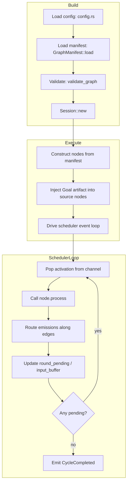
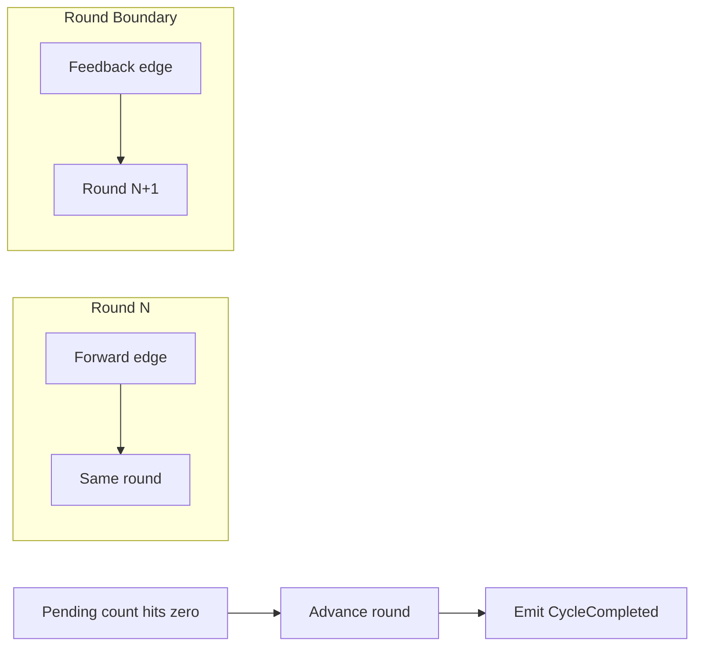
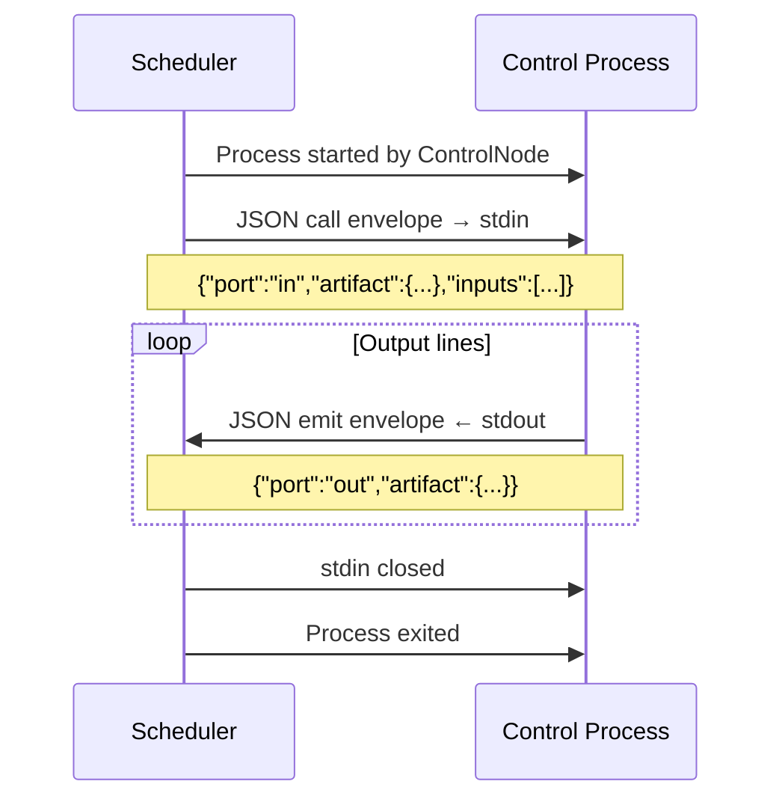

# AGENTS.md — Eureka

Agent guide to the Eureka runtime. Covers architecture, module layout, key invariants, and conventions.

---

## What this is

Eureka is a **graph-based execution engine** written in Rust. A run is a directed graph of *nodes* (LLM agents, subprocess control nodes) connected by typed *edges* carrying JSON artifacts. The topology, prompts, tools, and control-node definitions live in a single YAML manifest (`<graph_dir>/<graph>.yml`). The runtime loads the manifest, validates the graph, and executes it with an event-driven scheduler. There is no per-node Rust code — node types are data.

The shipped example at `example/coscientist.yml` shows one possible topology — an iterative research loop — with Python control nodes under `example/control/` and an arXiv search tool under `example/tools/`. Any graph shape can be expressed in a YAML manifest.

---

## Repository layout

```
Cargo.toml                    # workspace (resolver 3), strict clippy lints
deny.toml                     # cargo deny config (licenses/bans/advisories)
rust-toolchain.toml           # pinned to 1.96.0
eureka.toml                   # example runtime config (provider, budget, scheduler)
crates/
  eureka/                     # the library
    src/
      lib.rs                  # module map + re-exports (start here)
      config.rs               # layered config: DEFAULT_TOML → file → env (figment)
      error.rs                # EngineError enum
      graph/                  # PURE topology: data structures only
        artifact.rs           # Artifact { kind, data }
        control.rs            # ControlFlow, ControlDecision types
        edge.rs               # Edge { from, to, port, feedback }
        mod.rs                # re-exports
        node.rs               # Node trait, BoxedNode, Emit, NodeCtx, Usage
        port.rs               # PortDef, PortSpec, PortDirection
        spec.rs               # GraphSpec, GraphNodeSpec
        validate.rs           # Tarjan SCC, port-kind checks
      scheduler/              # event-driven executor
        scheduler.rs          # main loop, activation dispatch, budget ticks
        event.rs              # SchedulerEvent, SchedulerSignal types
        error.rs              # SchedulerError
      agents/                 # LLM-backed nodes
        client.rs             # LlmClient trait, RigClient (rig-core wrapper)
        def.rs                # AgentDef, ToolDef, AgentPort
        error.rs              # AgentError
        mod.rs                # re-exports
        node.rs               # LlmAgentNode (the Node impl)
        tools.rs              # CommandTool (shell tool runner)
      control/                # subprocess-backed nodes
        error.rs              # ControlError
        mod.rs                # re-exports
        node.rs               # ControlNode, ControlNodeDef
        process.rs            # shared subprocess runner
      manifest/               # YAML loader
        agent.rs              # AgentSpec
        control.rs            # ControlSpec
        graph.rs              # GraphManifest (the top-level loader)
        prompt.rs             # PromptLoader
      run.rs                  # RunRecord, RunEnvironment, CheckpointStore, SqliteRunPersistence
      session.rs              # assembles everything; entry point: Session::new / Session::run
      manager.rs              # RunManager lifecycle service
      tracing.rs              # optional SQLite event history writer
      rag/                    # RAG integration (opt-in via [rag] config section)
        mod.rs                # RagIndexHandle — type-erased VectorStoreIndexDyn wrapper
        init.rs               # register_sqlite_vec() — one-time sqlite-vec auto-extension
        indexer.rs            # RagDocument, RagIndexer — artifact → vector store pipeline
        embedding.rs          # build_rag_components — embedding model construction + type erasure
  eureka-cli/                 # the CLI binary
    src/
      main.rs                 # clap: daemon | start | session | validate | list
      commands/
        daemon.rs             # daemon lifecycle (start/stop/status)
        list.rs               # print graph manifest contents
        mod.rs                # command exports
        session.rs            # session introspection and control
        validate.rs           # validate command
        run.rs                # (unused, kept for reference)
      server.rs               # axum HTTP server for observability
    tests/
      coscientist_validate.rs # end-to-end mock validation test
example/                      # shipped example graph
  coscientist.yml             # the manifest (agents + control + edges)
  prompts/*.md               # agent system prompts
  control/*.py               # control node scripts (supervisor, ranker, proximity)
  tools/arxiv_search.py      # shell tool used by agents
  COSCIENTIST.md              # design notes for the example
docs/                         # spec docs
  db-session-spec.md
  http-session.md
  tracing-spec.md
  co-scientist-runtime-extensions.md
  expert-workflow.md
  server-driven-agent-architecture.md
```

---

## Build, test, lint

```bash
cargo build --release                 # binary: target/release/eureka-cli
cargo test --release                  # unit + integration tests
cargo test --release -p eureka-cli --test coscientist_validate  # e2e mock validation
cargo clippy --release                # lib + bins only — green
cargo clippy --all-targets --release  # includes tests — green
cargo run --release -- validate example/coscientist.yml          # validate shipped graph
cargo run --release -- daemon start                              # start daemon
cargo run --release -- start "<goal>" --domain chemistry          # submit a run
```

The workspace sets `pedantic`/`nursery` to `warn`, `unwrap_used`/`expect_used` to `deny`, and `unsafe_code` to `deny`. Test code lightens the deny via `#![cfg_attr(test, allow(clippy::unwrap_used, ...))]` at crate roots. (`unsafe_code` is `deny` rather than `forbid` so that `rag/init.rs` can use `#![allow(unsafe_code)]` for the single sqlite-vec registration call.)

---

## Architecture (how a run flows)



### Step-by-step

1. **Config** (`config.rs`): `EurekaConfig::load` merges `DEFAULT_TOML` → file (`eureka.toml` or `--config`) → env (`EUREKA_*`). `DEFAULT_TOML` is the single source of truth; sub-structs intentionally have no `Default`-via-serde fallbacks.

2. **Manifest** (`manifest/graph.rs`): `GraphManifest::load` reads the YAML, resolves relative prompt/command paths against the YAML's parent dir, and `to_graph_spec()` produces a pure `GraphSpec` (nodes + edges).

3. **Validation** (`graph/validate.rs`): before any model call, the graph is checked for: port-kind match, no dangling required inputs, reachability, unknown node kinds, governed cycles (every SCC must contain a node with a `halt` output port), and sink presence. Tarjan SCC is implemented inline.

4. **Session** (`session.rs`): `Session::new` loads + validates. `Session::run` constructs each node from the manifest (`build_agent_node` / `build_control_node`), injects the goal artifact into source nodes, and drives the scheduler.

5. **Scheduler** (`scheduler/scheduler.rs`): a single `tokio::select!` loop that pops activations off a channel, runs the node's `process()` via a spawned task in a `JoinSet` (concurrency capped by a `Semaphore`), routes emissions along outbound edges, buffers multi-input joins, tracks `round_pending`, and enforces budget backstops via a 100ms ticker.

6. **Agent node** (`agents/node.rs` + `agents/client.rs`): `LlmAgentNode::process` serializes the inbound artifact to JSON, runs an agentic loop via `rig-core` (prompt + `submit` tool + shell `CommandTool`s), and splits the returned JSON across the agent's output ports.

7. **Control node** (`control/node.rs` + `control/process.rs`): spawns a subprocess, writes a JSON call envelope to stdin, reads line-delimited JSON emit envelopes from stdout. Run-scoped env vars are injected through `RunEnvironment`. Agent shell tools receive the same environment.

8. **Observability** (`eureka-cli/src/server.rs`): an axum server on `127.0.0.1:{port}` exposes the endpoints listed in README.md. `track_live_state` folds scheduler events into a `LiveState` snapshot. Opt-in tracing writes durable scheduler events to the per-run SQLite `eureka_events` table.

---

## Key concepts / invariants

### Topology is data

Adding an agent or control node never requires Rust changes — only a YAML edit. The `kind` string on a `GraphNodeSpec` is the agent `id` (for agents) or the control node's `kind` string (for control nodes).

### Artifact = `(kind: String, data: JSON)`

Kinds are opaque strings matched at edge endpoints by the validator. There is no central enum of artifact kinds.

### Ports

`PortDef` in YAML is `{port, kind}`. Inputs are required by default; manifests may declare `required: false` for optional inputs — this flag is preserved through graph construction and validation.

### Feedback edges

Edges with `feedback: true` close cycles. They are excluded from source-node detection (so cyclic nodes still receive the initial goal) and deliver to `round + 1` instead of the current round.

### Round counting



- Forward edges deliver to the same round; feedback edges to `round + 1`.
- A round is complete only when its outstanding-activation count hits zero.
- The scheduler then advances to the next buffered round and emits a single `CycleCompleted`.
- `rounds_completed` counts fully drained cycles, not per-emit feedback crossings.

### Budget

`RunStats` aggregates from each `Node::process`'s `NodeUsage`:

| Metric | Source |
|---|---|
| `total_cost_usd` | `ProviderConfig::pricing` (input/output per-million) |
| `total_tokens` | rig's normalized `Usage` |
| `total_input_tokens` | From the provider |
| `total_output_tokens` | From the provider |

Backstops (`max_cost_usd`, `max_tokens`, `max_wallclock`, `max_rounds`) fire at the scheduler level. Providers that report zero usage only get wall-clock/round backstops.

### Concurrency

Activations run as concurrent tokio tasks in a `JoinSet`, capped by `scheduler.max_in_flight`. `abort_all` on cancel/drop cancels in-flight `process()` calls (dropping in-flight LLM HTTP requests).

### Provider switching

`ProviderKind` enum + `build_llm_client` map to `rig-core` provider clients. Set the matching `*_API_KEY` env var.

---

## Conventions

- Module-level docs (`//!`) on every file; `missing_docs` is `warn`.
- `unwrap`/`expect` are `deny` in non-test code — use `?`, `ok_or`, `unwrap_or`, or return engine/error types.
- Errors use `thiserror`. Wrap with context via `anyhow::Context` at CLI boundaries only.
- Re-exports live in each module's `mod.rs` and the top-level `lib.rs`.
- Tests are inline (`#[cfg(test)] mod tests`) per file.

---

## Control subprocess protocol



### Environment variables

| Variable | Value |
|---|---|
| `EUREKA_SESSION_ID` | Session UUID |
| `EUREKA_NODE_ID` | Node ID from the manifest |
| `EUREKA_ROUND` | Current round number |
| `EUREKA_CONFIG` | JSON-encoded node `config` |
| `EUREKA_DB_PATH` | Path to session SQLite database (if available) |
| `EUREKA_DB_SCHEMA_VERSION` | Runtime database contract version |
| `EUREKA_DB_NAMESPACE` | Plugin namespace, normally the node ID |

Reference implementations in `example/control/`:
- `supervisor.py` — cross-round context and supervisor state.
- `ranker.py` — Elo ratings and ranking state.
- `proximity.py` — in-memory proximity graph generation.

---

### Gotchas

- **Test `unwrap`s**: The workspace denies `unwrap_used`/`expect_used` in production code. Tests use `#![cfg_attr(test, allow(...))]` to keep clippy green without weakening the deny for real code paths.
- **`build_control_node` must not rewrite bare `command[0]`**: A bare `python3` must stay as `python3` so PATH lookup works. Only relative paths to actual scripts get resolved to absolute paths. The control node spawns with `current_dir = graph_dir`, so relative script arguments resolve correctly.
- **Tool named `submit`**: Agents reject any tool named `submit` because it shadows the terminal output tool, preventing the agent loop from terminating.
- **No serde default fallbacks on sub-structs**: All `Default` values live in `DEFAULT_TOML`. If a field is missing from the merged figment result, it means `DEFAULT_TOML` is incomplete — this is a bug we want caught immediately.
- **Env var underscore aliases**: Figment splits env keys on `_`, so `EUREKA_BUDGET_MAXWALLCLOCK` would be nested under `budget.max.wallclock`. Use the underscore-free alias `EUREKA_BUDGET_MAXWALLCLOCK` → `maxwallclock` → `max_wallclock` via serde `alias`. Same reasoning for `max_wallclock_secs`.
- **Cost budget needs pricing**: Without `[provider.pricing]` in the config, cost is not tracked and only token/wall-clock/round backstops fire.
- **SQLite schema**: Plugins should keep their own table namespaces and must not modify `eureka_*` tables owned by the runtime persistence layer.
- **Pause/Resume**: The runtime does not resume an activation interrupted mid-LLM-call or mid-subprocess. Recovery starts from the latest completed scheduler checkpoint.