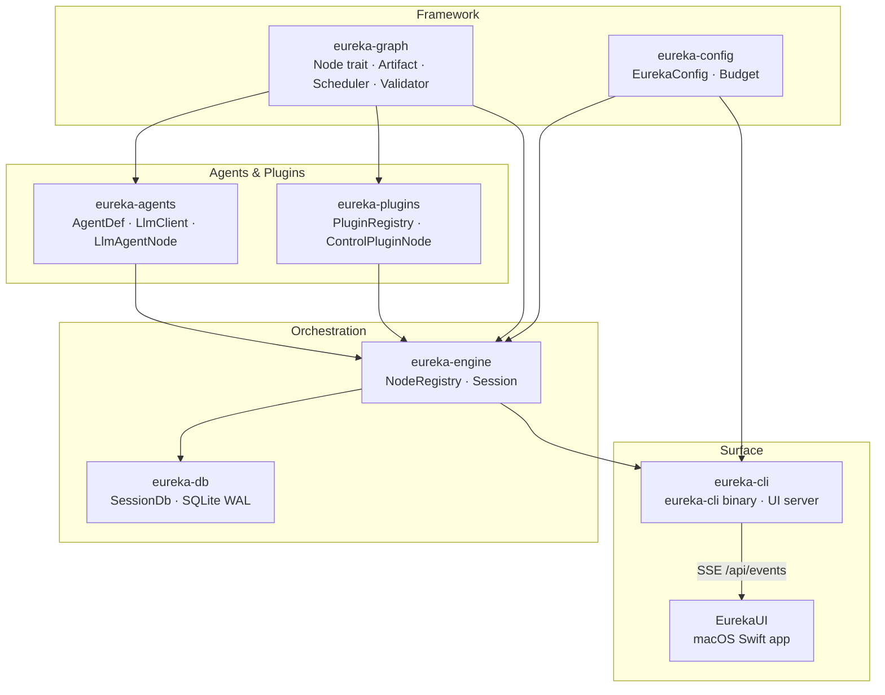
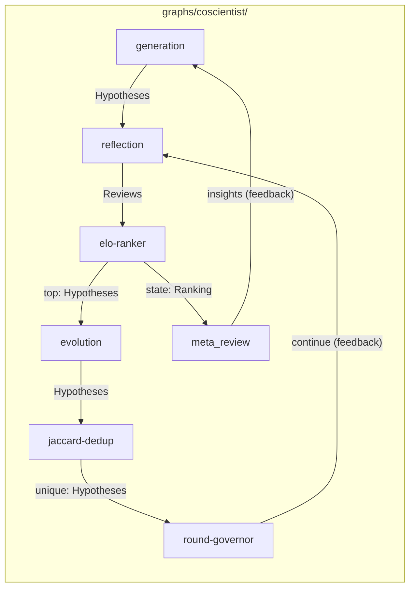

# Eureka — Graph-Based Multi-Agent AI Co-Scientist

> *εὕρηκα (heúrēka) — "I have found it": Archimedes' cry at the moment of discovery.*

**Status:** Active development | **Edition:** 2021 | **MSRV:** 1.96 | **License:** MIT/Apache-2.0

Eureka orchestrates multiple specialized LLM agents via a **data-driven execution
graph**, where the topology is a runtime configuration file rather than compiled code.
Inspired by Google Research's [AI co-scientist](https://research.google/blog/accelerating-scientific-breakthroughs-with-an-ai-co-scientist/) (Feb 2025). Built on [`rig`](https://docs.rs/rig-core).

## Architecture



## Crates

| Crate | Tests | Description |
|-------|-------|-------------|
| [`eureka-graph`](crates/eureka-graph) | 21 | Node trait, Artifact, Scheduler, Validator |
| [`eureka-agents`](crates/eureka-agents) | 16 | AgentDef loader, LlmClient, LlmAgentNode, CommandTool |
| [`eureka-engine`](crates/eureka-engine) | 3 | NodeRegistry, Session lifecycle |
| [`eureka-config`](crates/eureka-config) | 4 | Typed config from `eureka.toml` |
| [`eureka-db`](crates/eureka-db) | 3 | SQLite session persistence (WAL) |
| [`eureka-plugins`](crates/eureka-plugins) | 6 | Subprocess plugin system for control nodes |
| [`eureka-cli`](crates/eureka-cli) | 2 | Binary: run/eval/validate/list + UI server |

## Specs

Every feature has a spec in [`specs/`](specs/). See [`specs/INDEX.md`](specs/INDEX.md) for the full index.

| Spec | Crate | Description |
|------|-------|-------------|
| [graph-model](specs/eureka-graph/graph-model.md) | eureka-graph | `Artifact`, `Node`, `Port`, `Edge`, `GraphSpec` |
| [scheduler](specs/eureka-graph/scheduler.md) | eureka-graph | Event-driven execution, pending counter, rounds |
| [graph-validation](specs/eureka-graph/graph-validation.md) | eureka-graph | Six structural rules, Tarjan SCC |
| [control](specs/eureka-graph/control.md) | eureka-graph | `ControlSignal`, `Budget`, `RunStats` |
| [agent-as-data](specs/eureka-agents/agent-as-data.md) | eureka-agents | `.md`+`.json` agent loading, `LlmAgentNode` |
| [llm-client](specs/eureka-agents/llm-client.md) | eureka-agents | `LlmClient` trait, `RigClient`, 12 providers |
| [tools](specs/eureka-agents/tools.md) | eureka-agents | `ToolDef`, `CommandTool`, subprocess invocation |
| [plugins](specs/eureka-plugins/plugins.md) | eureka-plugins | Plugin manifest, discovery, invocation protocol |
| [node-registry](specs/eureka-engine/node-registry.md) | eureka-engine | `NodeRegistry`, constructor pattern |
| [session](specs/eureka-engine/session.md) | eureka-engine | `Session` lifecycle, event handling, DB writes |
| [session-db](specs/eureka-db/session-db.md) | eureka-db | Schema, `SessionDb` API, `DbError` |
| [config](specs/eureka-config/config.md) | eureka-config | `EurekaConfig`, all fields and defaults |
| [cli](specs/eureka-cli/cli.md) | eureka-cli | All four commands and flags |
| [ui-server](specs/eureka-cli/ui-server.md) | eureka-cli | HTTP/SSE server for EurekaUI |
| [graph-layout](specs/eureka-cli/graph-layout.md) | — | `graphs/{name}/` directory convention |

## Key Idea: Topology Is Data

A `GraphSpec` is a JSON file listing nodes (LLM agents and control plugins) and directed
edges between their typed ports. **Changing the agent system is a data change, not a
rewrite.** Switching topologies is one line in `eureka.toml`.

The default graph is the **AI Co-Scientist** — a fully connected hypothesis-generation
and refinement loop:



See [`graphs/coscientist/README.md`](graphs/coscientist/README.md) for a full walkthrough.

## Getting Started

```bash
# Set your API key (default provider: OpenRouter)
export OPENROUTER_API_KEY=...

# Validate the default graph
cargo run --bin eureka-cli -- validate graphs/coscientist/graph.json

# Run a research session
cargo run --bin eureka-cli -- run "Discover a novel catalyst for CO2 reduction"

# With optional flags
cargo run --bin eureka-cli -- run "CO2 catalyst" \
  -d "Focus on earth-abundant metals" \
  -D chemistry \
  --port 0          # disable UI server

# List available agents and graph specs
cargo run --bin eureka-cli -- list
```

## Graph Layout

```
graphs/
  coscientist/          <- Full AI co-scientist loop
    README.md
    graph.json          <- GraphSpec (nodes, edges, metadata)
    agents/             <- LLM node definitions (.md preamble + .json schema)
      generation.{md,json}
      reflection.{md,json}
      evolution.{md,json}
      meta_review.{md,json}
    plugins/            <- Control node subprocess scripts
      elo-ranker/
      jaccard-dedup/
      round-governor/
    tools/              <- Agent tool scripts (called via CommandTool)
      arxiv_search.py
```

See [`specs/eureka-cli/graph-layout.md`](specs/eureka-cli/graph-layout.md).

## Validation Rules

Six rules checked at load time — before any LLM call:

1. **Port kind match** — every edge's output kind equals the consumer's input kind
2. **No dangling required inputs** — every required non-Goal port has ≥1 inbound edge
3. **Reachability** — BFS from Goal sources visits every node
4. **Unknown node kinds** — every node kind must be registered (agent or plugin)
5. **Governed cycles** — every cycle contains a node with a `"halt"` output port
6. **Sink presence** — at least one node emits a terminal (unconsumed) artifact kind

## Configuration

```toml
# eureka.toml
graph = "graphs/coscientist/graph.json"

[provider]
kind = "openrouter"
generation_model = "deepseek/deepseek-v4-flash"

# Per-agent model overrides
[provider.agent_models]
# meta_review = "anthropic/claude-opus-4"

[budget]
max_cost_usd    = 5.0
max_tokens      = 2_000_000
max_wallclock   = "45m"
max_rounds      = 100   # safety backstop; primary control is round-governor in graph.json
```

## Real-Time UI

The CLI starts an HTTP server on port 7773 (disable with `--port 0`):

| Endpoint | Description |
|---|---|
| `GET /api/graph` | Full `GraphSpec` JSON |
| `GET /api/state` | Live node activity + round counter |
| `GET /api/events` | Server-Sent Events stream of scheduler events |

The **EurekaUI** macOS app (`EurekaUI/`) connects to this server and provides a
scientist-facing view: Elo leaderboard, hypothesis reader, round timeline, review
cards, and meta-review overview.
