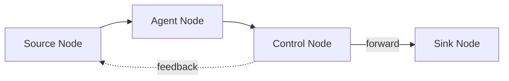
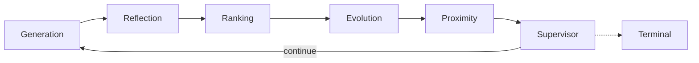
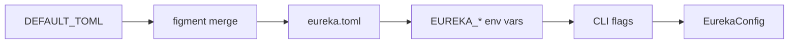
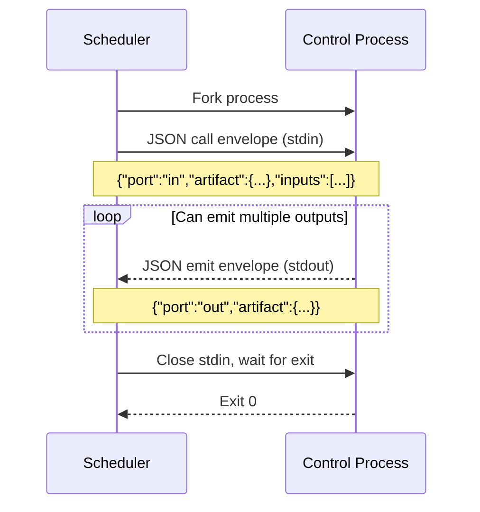

# Eureka

Eureka is a **graph-based execution engine** for AI-agent workflows, written in Rust.
A run is a directed graph of nodes (LLM agents, subprocess control nodes) connected
by typed ports carrying JSON artifacts. Topology, prompts, tools, and control-node
commands all live in a single YAML manifest. The runtime validates the graph at load
time, then executes it with a concurrent, budget-aware scheduler.

The engine is wholly generic — the node types, artifact kinds, and graph shape are
defined in the manifest, not in Rust code. Adding a new agent or control node never
requires a recompile.



A straight-line pipeline:
```
intake → classify → review → summarize
```

Or an iterative research loop, such as the shipped co-scientist graph:



The shipped example lives in [`example/`](example/) — a manifest, prompts, control
scripts, and tools that together reproduce an "AI co-scientist" topology. It is one
workload among many that the engine can express.

---

## Implemented

- YAML-defined graph topology with typed ports and JSON artifacts.
- LLM agent nodes with configurable prompts, output schemas, models, and tools.
- Subprocess control nodes (any executable) using JSON stdin/stdout.
- Port-kind validation, reachability, sink checks, governed-cycle checks, optional input ports.
- Concurrent node activation with configurable in-flight limits.
- Feedback edges and synchronized execution rounds.
- Cost, token, wall-clock, and round budget backstops.
- Per-run SQLite database for cross-round node state.
- Durable lifecycle records and scheduler checkpoints with pause/resume.
- Process-restart resume from the latest completed scheduler checkpoint.
- Human artifact injection into paused runs.
- `RunManager` lifecycle service for background execution and recovery.
- HTTP endpoints for graph data, live state, SSE events, and run lifecycle (`/runs`).
- Optional durable scheduler event history in SQLite.

Recovery from an activation interrupted mid-LLM-call or mid-subprocess is unsupported;
the runtime resumes from the latest completed scheduler checkpoint.

---

## Quick start

Build and validate:

```bash
cargo build --release
cargo run --release -- validate example/coscientist.yml
```

Run an example session via the daemon:

```bash
export OPENROUTER_API_KEY=sk-or-...

cargo run --release -- daemon start --port 7773 &
cargo run --release -- start \
  "Identify novel catalysts for CO₂ reduction" \
  --domain chemistry
```

Open `http://127.0.0.1:7773` for the live UI. The binary is `target/release/eureka-cli`.

---

## Architecture (layers)

```mermaid
flowchart TB
    subgraph CLI ["CLI & HTTP (eureka-cli)"]
        CLAP[clap: daemon | start | session | validate | list]
        AXUM[axum server: /api/graph, /api/state, /api/events, /runs/*]
    end

    subgraph CORE ["Runtime Library (eureka)"]
        CONFIG[config.rs: layered figment merge]
        MANIFEST[manifest: YAML → GraphSpec]
        VALIDATE[validate.rs: port-kind, SCC, reachability]
        SESSION[session.rs: assemble & run]
        SCHED[scheduler.rs: event-loop, budget backstops]
        AGENTS[agents: LlmAgentNode + rig-core LLM client]
        CTRL[control: ControlNode + subprocess runner]
        RUN[run.rs: RunRecord, CheckpointStore, SqliteRunPersistence]
    end

    CONFIG --> MANIFEST
    MANIFEST --> VALIDATE
    SESSION --> SCHED
    SESSION --> AGENTS
    SESSION --> CTRL
    SCHED --> AGENTS
    SCHED --> CTRL
    SCHED --> RUN
    CTRL --> RUN
    AGENTS --> RUN
```

---

## Configuration



| Layer | Source | Example |
|---|---|---|
| Built-in defaults | `config.rs` → `DEFAULT_TOML` | `max_rounds = 12` |
| File | `eureka.toml` or `--config` | `graph = "example/coscientist.yml"` |
| Environment | `EUREKA_*` prefix | `EUREKA_BUDGET_MAXWALLCLOCK=30m` |
| CLI | Clap flags | `--max-rounds 50` (patched post-load) |

Minimal configuration:

```toml
graph = "example/coscientist.yml"

[provider]
kind = "openrouter"
generation_model = "deepseek/deepseek-v4-flash"

[scheduler]
max_in_flight = 8

[budget]
max_cost_usd = 25.0
max_tokens = 5_000_000
max_wallclock = "45m"
max_rounds = 12

[tracing]
enabled = false
```

### API keys

| Provider | Env var | Example model |
|---|---|---|
| `anthropic` | `ANTHROPIC_API_KEY` | `claude-sonnet-4-20250514` |
| `openai` | `OPENAI_API_KEY` | `gpt-4o` |
| `openrouter` | `OPENROUTER_API_KEY` | `deepseek/deepseek-v4-flash` |
| `gemini` | `GEMINI_API_KEY` | `gemini-2.0-flash` |
| `groq` | `GROQ_API_KEY` | `llama-3.3-70b-versatile` |
| `deepseek` | `DEEPSEEK_API_KEY` | `deepseek-chat` |
| `mistral` | `MISTRAL_API_KEY` | `mistral-large-latest` |
| `cohere` | `COHERE_API_KEY` | `command-r-plus` |
| `perplexity` | `PERPLEXITY_API_KEY` | `sonar-pro` |
| `together` | `TOGETHER_API_KEY` | `meta-llama/Llama-3-70b-chat-hf` |
| `xai` | `XAI_API_KEY` | `grok-3-mini` |
| `ollama` | (none) | `llama3.1:8b` |

---

## Graph manifests

A manifest declares agents, control nodes, and edges in one YAML file.

```yaml
name: Review workflow

agents:
  - id: classifier
    prompt: prompts/classifier.md
    inputs:
      - { port: in, kind: Intake }
    outputs:
      - { port: out, kind: Classification }
    output_schema:
      type: object
      required: [category]
      properties:
        category: { type: string }

control:
  - id: review
    kind: human_review
    command: [python3, control/review.py]
    inputs:
      - { port: in, kind: Classification }
    outputs:
      - { port: approved, kind: Decision }
      - { port: rejected, kind: Decision }

edges:
  - { from_node: classifier, from_port: out,
      to_node: review, to_port: in }
```

Key concepts:

- **Artifact** = `{ kind, data }`. Kinds are opaque strings compared at edge endpoints.
- **Port** = named endpoint declaring the artifact kind it accepts or emits.
- **Forward edge** → same round. **Feedback edge** (`feedback: true`) → next round.
- **Source node** = receives the initial `Goal` artifact. Feedback edges are excluded from source detection so cyclic nodes still receive the goal.
- **Sink node** = produces an artifact kind no other node consumes.

---

## Control-node protocol

Control nodes communicate via JSON envelopes on stdin/stdout.



Call envelope:
```json
{
  "port": "in",
  "artifact": { "kind": "Intake", "data": { "text": "..." } },
  "inputs": [
    { "port": "in", "artifact": { "kind": "Intake", "data": { "text": "..." } } }
  ]
}
```

Emit envelope (one per line of stdout):
```json
{
  "port": "out",
  "artifact": { "kind": "Classification", "data": { "category": "..." } }
}
```

Environment variables:

```text
EUREKA_SESSION_ID       stable run identifier
EUREKA_NODE_ID          manifest node ID
EUREKA_ROUND            current scheduler round
EUREKA_CONFIG           JSON-encoded node config
EUREKA_DB_PATH          per-run SQLite path
EUREKA_DB_SCHEMA_VERSION  runtime contract version
EUREKA_DB_NAMESPACE     plugin namespace (normally node ID)
```

Agent shell tools receive the same environment.

---

## Persistence and run files

```
<graph directory>/.eureka/sessions/
  <run_id>.sqlite    # run metadata, checkpoints, event history, plugin/tool state
```

The SQLite integration provides:
- Shared per-run database path for cross-round node state.
- Durable scheduler checkpoints with pause/resume.
- Scheduler event history (opt-in via `[tracing]`).
- Run lifecycle records with revision-based optimistic concurrency.
- Process-restart resume from the latest completed checkpoint.

---

## HTTP and observability

The CLI server (started with `daemon start --port PORT`) exposes:

| Endpoint | Purpose |
|---|---|
| `GET /api/graph` | Validated graph topology. |
| `GET /api/state` | In-memory live state for the active run. |
| `GET /api/events` | SSE stream of scheduler events. |
| `GET /api/events/history` | Historical scheduler events from SQLite. |
| `GET /api/run` | Durable lifecycle metadata for the run. |
| `POST /runs` | Create a new run via `RunManager`. |
| `GET /runs` | List all runs managed by the daemon. |
| `GET /runs/{id}` | Get run details. |
| `POST /runs/{id}/pause` | Pause a running run. |
| `POST /runs/{id}/resume` | Resume a paused run. |

Enable durable event history:

```toml
[tracing]
enabled = true
include_artifacts = false
```

---

## Library entry point

```rust,no_run
use eureka::config::EurekaConfig;
use eureka::Session;

let config = EurekaConfig::load(Some(std::path::Path::new("eureka.toml")))?;
let mut session = Session::new(config, &uuid::Uuid::now_v7().to_string(), None)?;

let stats = session
    .run(serde_json::json!({
        "goal": "Find promising catalysts for CO₂ reduction",
        "domain": "chemistry"
    }))
    .await?;

println!("completed {} rounds", stats.rounds_completed);
```

---

## Development

```bash
cargo test --release
cargo build --release
cargo clippy --all-targets --release
```

### Repository layout

```
crates/eureka/       runtime library
crates/eureka-cli/   CLI and HTTP server
example/             shipped example graph, prompts, controls, and tools
docs/                HTTP, persistence, and tracing specifications
eureka.toml          example runtime configuration
```

### Contributor references

- [`AGENTS.md`](AGENTS.md) — architecture, invariants, conventions, gotchas.
- [`example/COSCIENTIST.md`](example/COSCIENTIST.md) — design notes for the shipped example graph.

---

## License

Dual-licensed under MIT or Apache-2.0, at your option.