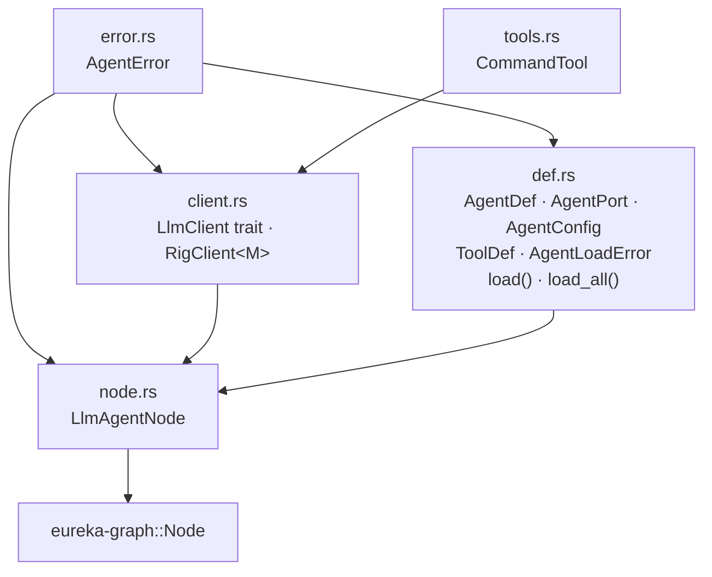

# eureka-agents

> Agent-as-data: load agent definitions from `.md` + `.json` files and drive them with a single generic LLM node.

**Status:** Active | **Depends on:** `eureka-graph` | **Used by:** `eureka-cli`

Agents are not Rust structs with hardcoded prompts — they are file pairs loaded at
startup. A single `LlmAgentNode` drives any agent definition by running an agentic
loop: the LLM reasons freely (optionally calling shell tools), then calls the implicit
`submit` tool to deliver its structured JSON output. Adding or tuning an agent requires
only editing files, not recompiling.

## Specs

| Spec | Description |
|------|-------------|
| [agent-as-data](../../specs/eureka-agents/agent-as-data.md) | `AgentDef` loading, `LlmAgentNode`, multi-port handling |
| [llm-client](../../specs/eureka-agents/llm-client.md) | `LlmClient` trait, `RigClient`, agentic loop, `submit` tool |
| [tools](../../specs/eureka-agents/tools.md) | `ToolDef`, `CommandTool`, invocation model, template substitution |
| [error-types](../../specs/eureka-agents/error-types.md) | `AgentError`, `AgentLoadError` |

## Modules



| File | Key exports |
|------|-------------|
| `error.rs` | `enum AgentError` |
| `client.rs` | `trait LlmClient`, `struct RigClient<M>` |
| `def.rs` | `struct AgentDef`, `struct AgentPort`, `struct AgentConfig`, `struct ToolDef`, `enum AgentLoadError`, `AgentDef::load()`, `AgentDef::load_all()`, `AgentDef::to_port_spec()` |
| `node.rs` | `struct LlmAgentNode` |
| `tools.rs` | `struct CommandTool` |

## Public API

### AgentDef

```rust
pub struct AgentDef {
    pub name:          String,
    pub description:   Option<String>,
    pub preamble:      String,             // contents of <name>.md
    pub inputs:        Vec<AgentPort>,
    pub outputs:       Vec<AgentPort>,
    pub config:        AgentConfig,
    pub output_schema: serde_json::Value,  // JSON Schema for the submit tool
    pub tools:         Vec<ToolDef>,       // shell tools; empty if none declared
}

pub struct AgentPort {
    pub kind: ArtifactKind,  // artifact kind consumed or produced
    pub port: String,        // port name used in graph edges
}

pub struct AgentConfig {
    pub temperature:    f64,  // default: 0.7
    pub max_iterations: u32,  // default: 10
}

impl AgentDef {
    pub fn load(dir: &Path, name: &str) -> Result<Self, AgentLoadError>;
    pub fn load_all(dir: &Path) -> Result<Vec<Self>, AgentLoadError>;
    pub fn to_port_spec(&self) -> PortSpec;
}
```

`load_all` scans for `.json` files with a matching `.md` sibling. Files without a
pair are silently skipped. Results are sorted by name. The file stem becomes the agent
name (`generation.json` → `"generation"`).

### LlmClient

```rust
#[async_trait]
pub trait LlmClient: Send + Sync {
    async fn run_agent_loop(
        &self,
        preamble:       &str,
        output_schema:  &serde_json::Value,
        tools:          &[ToolDef],
        initial_message: &str,
        max_iterations: u32,
        temperature:    f64,
    ) -> Result<serde_json::Value, AgentError>;
}
```

The agent loop runs until the LLM calls the implicit `submit` tool, or until
`max_iterations` is exhausted (returns `AgentError::ExtractionFailed`).

### LlmAgentNode

```rust
pub struct LlmAgentNode {
    def:    Arc<AgentDef>,
    client: Arc<dyn LlmClient>,
}
// implements eureka_graph::node::Node
```

On activation: serialize incoming artifact `data` as the initial message (prefixed
with `Port: <name>` for multi-input agents), run the agentic loop, then fan out the
returned JSON across output ports (single-output: whole value; multi-output: keyed by
port name).

## Testing

Tests cover: `AgentDef::load` with both `"inputs"` array and legacy `"input"` singular
formats; `load_all` with paired and orphaned files; `to_port_spec` correctness;
`LlmAgentNode` single-output, multi-output, and multi-input prompt formatting with mock
clients.
