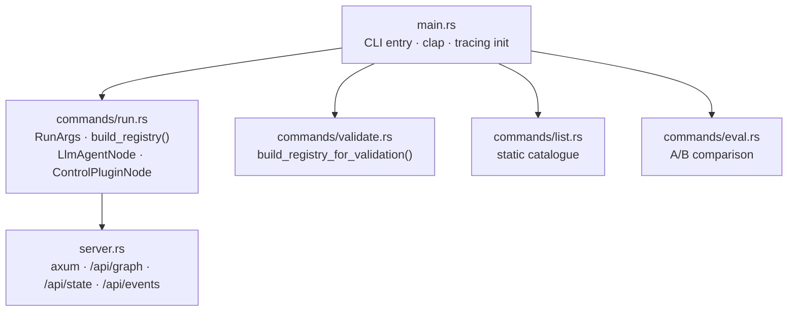

# eureka-cli

> The `eureka` binary: run, validate, list, eval, and serve the UI.

**Status:** Active | **Depends on:** `eureka-graph`, `eureka-agents`, `eureka-engine`, `eureka-config`

The only crate with a `main`. Wires the graph, agents, engine, and config into four
user-facing commands, and runs an embedded HTTP/SSE server so the EurekaUI Swift app
can observe the session in real time.

## Specs

| Spec | Description |
|------|-------------|
| [cli](../../specs/eureka-cli/cli.md) | All four commands, flags, and run sequence |
| [control-nodes](../../specs/eureka-cli/control-nodes.md) | Plugin-based control nodes: `round-governor`, `elo-ranker`, `jaccard-dedup` |
| [ui-server](../../specs/eureka-cli/ui-server.md) | HTTP endpoints, SSE event stream, `LiveState` |
| [graph-layout](../../specs/eureka-cli/graph-layout.md) | `graphs/{name}/graph.json` + `agents/` convention |

## Modules



| File | Key exports |
|------|-------------|
| `main.rs` | Binary entry, `Commands` enum |
| `commands/run.rs` | `struct RunArgs`, `pub fn build_registry()`, `fn build_llm_client()` |
| `commands/validate.rs` | `fn build_registry_for_validation()` |
| `commands/eval.rs` | `struct EvalArgs` |
| `server.rs` | `fn start_server()`, `struct LiveState` |

## Commands

```
eureka run     <goal>              Run a research session
eureka validate <graph>            Validate a graph spec file
eureka list                        List agents, control nodes, graph specs
eureka eval    <a> <b> <goal>      A/B compare two graph topologies

Global: --config <path>            Config file [default: eureka.toml]
Run:    --port <n>                 UI server port [default: 7773, 0=off]
```

## Control Plugins

Control behavior is implemented as subprocess plugins (Python scripts), not compiled
Rust nodes. `build_registry()` discovers them via `PluginRegistry::discover()` and
registers each as a `ControlPluginNode`. Config is read from `spec.config` in the graph.

| Plugin kind | Behavior |
|---|---|
| `round-governor` | Round limit: emits input on `continue` if `round < max_rounds`, else emits on `halt` |
| `elo-ranker` | Pairwise Elo tournament: emits `top` (top-k hypotheses) and `state` (full ratings) |
| `jaccard-dedup` | Word-level Jaccard deduplication: emits `unique` (deduplicated hypotheses) |

## UI Server

Runs concurrently with `session.run()` on `--port` (default 7773).

| Endpoint | Response |
|----------|----------|
| `GET /api/graph` | `GraphSpec` JSON (static) |
| `GET /api/state` | `LiveState` snapshot |
| `GET /api/events` | SSE stream of `SchedulerEvent` |

## Testing

Tests in `commands/validate.rs` cover: `build_registry_for_validation()` loading agent
definitions and plugin manifests from temporary directories, and gracefully handling
missing directories.
