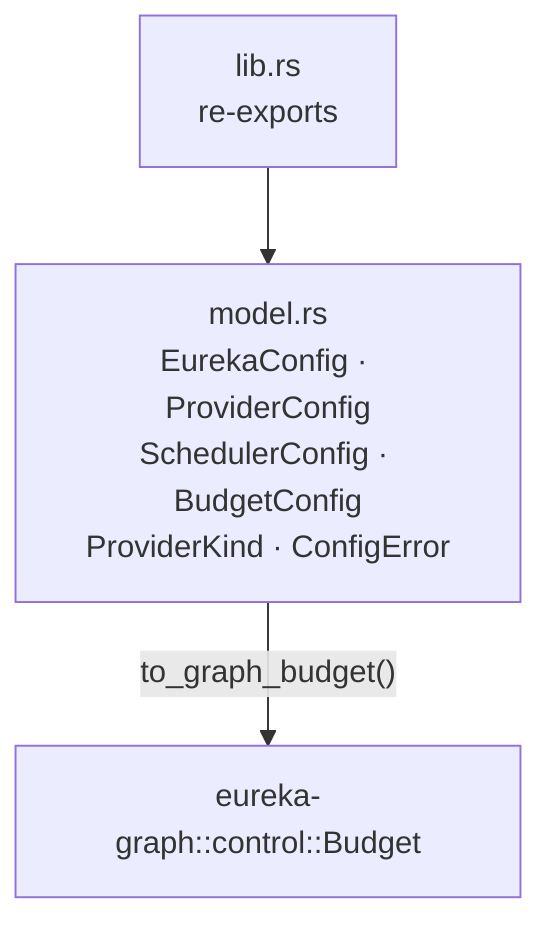

# eureka-config

> Typed configuration loaded from `eureka.toml`.

**Status:** Active | **Depends on:** `eureka-graph` | **Used by:** `eureka-engine`, `eureka-cli`

`EurekaConfig` is the single configuration struct for a run. Deserialized from
`eureka.toml` with serde defaults for every field, so an empty file is valid.
Produces `eureka_graph::control::Budget` via `to_graph_budget()`.

## Specs

| Spec | Description |
|------|-------------|
| [config](../../specs/eureka-config/config.md) | Full field reference, defaults, duration parsing |

## Modules



| File | Key exports |
|------|-------------|
| `model.rs` | `struct EurekaConfig`, `struct ProviderConfig`, `struct SchedulerConfig`, `struct BudgetConfig`, `enum ProviderKind`, `enum ConfigError` |

## Public API

```rust
pub struct EurekaConfig {
    pub graph:     String,          // default: "graphs/coscientist/graph.json"
    pub provider:  ProviderConfig,
    pub scheduler: SchedulerConfig,
    pub budget:    BudgetConfig,
}
```

> There is **no `agents_dir` field**. The agents directory is always derived by the
> caller as `parent(config.graph) / "agents"`.

```rust
impl EurekaConfig {
    pub fn default() -> Self;
    pub fn load() -> Result<Self, ConfigError>;           // stub — returns default()
    pub fn from_toml(s: &str) -> Result<Self, ConfigError>;
    pub fn to_graph_budget(&self) -> eureka_graph::control::Budget;
}
```

### Supported Providers

```
openrouter · anthropic · openai · gemini · groq · mistral
cohere · deepseek · perplexity · together · xai · ollama
```

### Example `eureka.toml`

```toml
graph = "graphs/coscientist/graph.json"

[provider]
kind = "anthropic"
generation_model = "claude-sonnet-4-20250514"

[scheduler]
max_in_flight = 8

[budget]
max_cost_usd  = 25.0
max_tokens    = 5_000_000
max_wallclock = "45m"
max_rounds    = 100
```

## Testing

4 tests: default field values, duration string parsing (`30s`/`45m`/`2h`), full TOML
deserialization, `to_graph_budget()` conversion.
