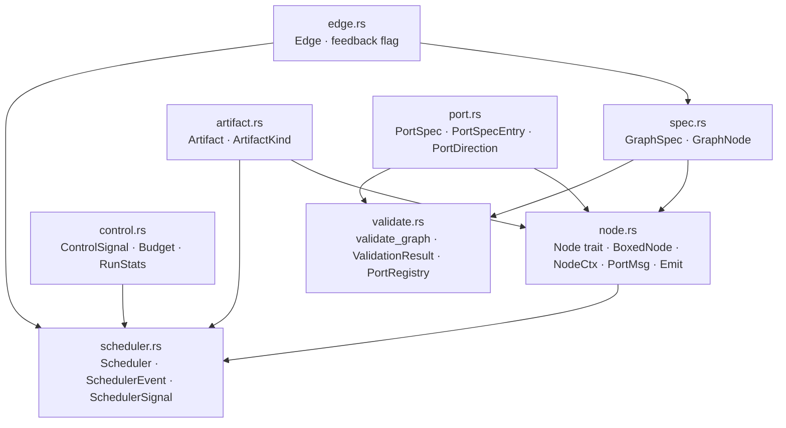

# eureka-graph

> Core framework: artifacts, nodes, ports, edges, scheduler, and validator.

**Status:** Active | **Used by:** `eureka-agents`, `eureka-engine`, `eureka-cli`, `eureka-config`

Every other crate depends on this one. It defines the typed building blocks of the
execution graph, the event-driven scheduler that routes artifacts between nodes, and the
pre-flight validator that proves structural correctness before any LLM call is made.

## Specs

| Spec | Description |
|------|-------------|
| [graph-model](../../specs/eureka-graph/graph-model.md) | `Artifact`, `Node`, `Port`, `Edge`, `GraphSpec` types |
| [scheduler](../../specs/eureka-graph/scheduler.md) | Event-driven execution, pending counter, round counting |
| [graph-validation](../../specs/eureka-graph/graph-validation.md) | Six structural rules checked at load time |

## Modules



| File | Key exports |
|------|-------------|
| `artifact.rs` | `type ArtifactKind = String`, `struct Artifact { kind, data: Value }` |
| `node.rs` | `trait Node`, `struct BoxedNode`, `struct NodeCtx`, `struct PortMsg`, `struct Emit`, `enum NodeError` |
| `port.rs` | `struct PortSpec`, `struct PortSpecEntry`, `enum PortDirection` |
| `edge.rs` | `struct Edge` (with `feedback: bool`) |
| `spec.rs` | `struct GraphSpec`, `GraphSpec::from_json()`, `GraphSpec::from_toml()` |
| `control.rs` | `enum ControlSignal`, `struct Budget`, `struct RunStats` |
| `validate.rs` | `fn validate_graph()`, `struct ValidationResult`, `struct PortRegistry` |
| `scheduler.rs` | `struct Scheduler`, `enum SchedulerEvent`, `enum SchedulerSignal` |

## Public API

### Artifact

```rust
pub type ArtifactKind = String;

pub struct Artifact {
    pub kind: ArtifactKind,
    pub data: serde_json::Value,
}
```

All inter-node messages are `Artifact`. Kind is an open string — not an enum —
so graphs and agents can define new kinds without modifying Rust code.

### Node Trait

```rust
pub trait Node: Send + Sync {
    fn ports(&self) -> PortSpec;
    async fn process(&self, ctx: &NodeCtx, msg: PortMsg)
        -> Result<Vec<Emit>, NodeError>;
}

pub struct BoxedNode { /* wraps Arc<dyn Node> */ }
impl BoxedNode {
    pub fn new(node: impl Node + 'static) -> Self;
    pub fn ports(&self) -> PortSpec;
    pub async fn process(&self, ctx: &NodeCtx, msg: PortMsg) -> Result<Vec<Emit>, NodeError>;
}
```

`BoxedNode` is a newtype struct, not a type alias. It wraps `Arc<dyn Node>` and is `Clone`.

### Validation

```rust
pub fn validate_graph(spec: &GraphSpec, registry: &PortRegistry) -> ValidationResult;
```

Checks six rules: port kind match, no dangling required inputs, full reachability,
unknown node kind detection, governed cycles (Tarjan SCC), and sink presence.
Collects all errors before returning.

## Testing

Tests cover: edge creation, port spec lookups, required input detection,
`GraphSpec` round-trip serialization, source/sink node detection, scheduler startup,
signal-sender liveness, run-with-no-work termination, all six validator rules,
Tarjan SCC cycle detection, `BoxedNode` dispatch, and budget exhaustion detection.
