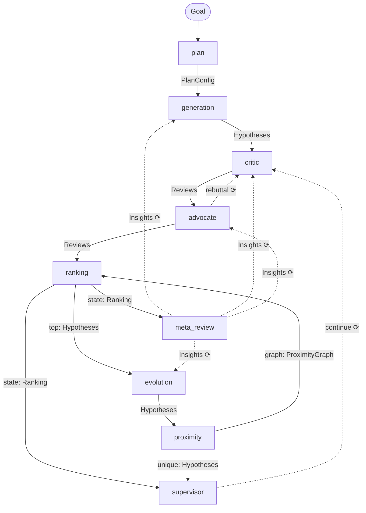

# AI Co-Scientist Example Graph

| Field      | Value         |
|------------|---------------|
| Status     | Draft         |
| Type       | Informational |
| Created    | 2026-07-14    |
| Reference  | Google Research, AI co-scientist, Feb 2025 |

## Abstract

Documents the AI co-scientist example graph shipped in `coscientist.yml`. The graph is a reproduction of the multi-agent scientific reasoning system described in Google Research's "AI co-scientist" paper (Feb 2025). It demonstrates Eureka's full feature set: LLM agent nodes, subprocess control nodes, typed artifact edges, feedback loops, shared tools, and persistent context memory.

## Specification

### Overview

The co-scientist is a closed-loop scientific hypothesis engine. A single `Goal` artifact enters the graph; the system iteratively generates, debates, ranks, evolves, and refines hypotheses until a convergence or budget condition is met, then emits a research `Overview`.

The graph contains eight nodes: five LLM agent nodes and three subprocess control nodes.



Solid edges carry artifacts in the current round. Dashed edges (`⟳`) are feedback — artifacts arrive in round N+1.

### Artifact Kinds

| Kind | Producer | Consumer(s) | Description |
|------|----------|-------------|-------------|
| `Goal` | runtime (user input) | `plan` | Raw natural language research goal |
| `PlanConfig` | `plan` | `generation` | Structured plan: domain, focus areas, constraints, criteria |
| `Hypotheses` | `generation`, `evolution`, `ranking`, `proximity`, `supervisor` | `critic`, `evolution`, `proximity`, `supervisor` | Array of hypothesis objects |
| `Reviews` | `critic`, `advocate` | `advocate`, `ranking`, `critic` (rebuttal) | Array of review objects with scores |
| `Ranking` | `ranking` | `meta_review`, `supervisor` | Full Elo tournament state |
| `ProximityGraph` | `proximity` | `ranking` | Similarity graph for matchmaking |
| `Insights` | `meta_review` | `generation`, `critic`, `advocate`, `evolution` | Per-agent feedback for next round |
| `Overview` | `meta_review` | (terminal output) | Comprehensive research synthesis |
| `Control` | `supervisor` | (terminal signal) | Halt signal with final stats |

### LLM Agent Nodes

#### `plan`

Converts the raw `Goal` string into a structured `PlanConfig`. Fields: `domain`, `research_goal` (clarified), `constraints`, `focus_areas` (3–5), `methods_to_avoid`, `hypothesis_criteria`, `evaluation_criteria`. Downstream agents use the plan to stay on-topic and ensure coverage across all focus areas.

#### `generation`

Produces initial `Hypotheses` from `PlanConfig`. Employs three techniques: literature exploration via arXiv search, iterative assumption decomposition (building hypothesis → sub-assumption chains), and research expansion (filling gaps identified by the `meta_review` `Insights` context input). Each hypothesis carries: `statement`, `rationale`, `assumptions`, `testable_predictions`, `proposed_experiment`, `citations`.

#### `critic`

Adversarial reviewer. Processes each hypothesis through a seven-step pipeline:

1. **Initial filter** — quick no-tools discard of clearly flawed hypotheses (`eliminated: true`)
2. **Literature challenge** — arXiv search for contradicting or preempting prior work
3. **Observation review** — checks whether the hypothesis explains known experimental observations better than the current consensus
4. **Assumption attack** — decomposes hypothesis into sub-assumptions; identifies load-bearing failures
5. **Experiment critique** — evaluates controls, confounds, statistical power, false-positive failure modes
6. **Step-wise simulation** — traces the mechanism step-by-step; locates the most likely failure point
7. **Prior-round sharpening** — if a `rebuttal` feedback input is present, escalates unsettled challenges from the prior round

Emits `Reviews` with a preliminary `score` (0–10) and optional `eliminated` flag.

#### `advocate`

Scientific defender. For each critic review: defends defensible objections with counter-evidence, concedes valid ones, and proposes minimal refinements. Reinstates or confirms eliminated hypotheses. Produces the authoritative post-debate score across four dimensions (each 0–10, final score = mean):

- **Novelty** — core claim survives literature challenge
- **Correctness** — foundational assumptions hold after attack
- **Feasibility** — proposed experiment survives critique
- **Impact** — if confirmed, meaningfully advances the field

Emits `Reviews` (`kind: debate_synthesis`) with a `rebuttal` field that the critic reads in the next round to sharpen its challenge.

#### `evolution`

Refines top-ranked hypotheses from the `Ranking` `top` port using six strategies, applied across the hypothesis pool: `grounding` (literature-backed gap filling), `coherence` (assumption correction), `inspiration` (new hypothesis from pattern), `combination` (merge two parents), `simplification` (strip non-essential components), `out_of_box` (divergent idea). Each offspring records `parent_indices`, `operation`, and `change_rationale`.

#### `meta_review`

Synthesises the full tournament `Ranking` state into two outputs:

- **`Insights`** — per-agent feedback: `generation_context` (gaps and directions), `debate_heuristics` (challenge/rebuttal patterns), `evolution_guidance` (strategy effectiveness), plus `recurring_patterns`, `common_weaknesses`, `promising_directions`.
- **`Overview`** — final research synthesis: `summary`, `key_insights`, `open_questions`, `suggested_next_steps`, `research_contacts` (domain expert suggestions with rationale).

### Subprocess Control Nodes

#### `ranking` (kind: `elo-ranker`)

Runs a persistent Elo tournament over all reviewed hypotheses. Config fields: `items_field`, `score_field`, `item_field`, `id_field`, `output_field`, `top_k`. Optimisations: proximity-weighted K-factor (similar hypotheses get larger updates), K-factor decay after 8+ matches, Elo-gap pruning (skip comparisons with gap > 400), newcomer boost for hypotheses with ≤ 2 matches. Emits `top` (`Hypotheses`, top-k by Elo) and `state` (`Ranking`, full tournament state). Persists ratings to `EUREKA_DB_PATH` across rounds.

#### `proximity` (kind: `proximity`)

Builds a similarity graph over hypothesis statements using TF-IDF cosine similarity (configurable to Jaccard). Deduplicates hypotheses above a similarity threshold (default 0.65) and selects a diverse frontier of up to `max_frontier` candidates. Emits `unique` (`Hypotheses`) and `graph` (`ProximityGraph`). The graph feeds `ranking` to weight matchmaking toward similar-hypothesis pairs.

#### `supervisor` (kind: `supervisor`)

Computes tournament statistics each round: total hypotheses, Elo spread, avg/max/min Elo, unique statements, Elo spread delta from prior round, generation vs. evolution effectiveness (avg Elo split by `operation` presence), and `recommended_emphasis` (`generation` or `evolution`). Decides continue vs. halt based on `max_rounds`, `min_rounds`, `convergence_threshold` (Elo spread below threshold), and `min_hypotheses`. On `continue`, forwards top hypotheses with full stats and prior context to the `critic` for the next round.

### Shared Tools

All LLM agent nodes except `plan` have access to:

| Tool | Command | Purpose |
|------|---------|---------|
| `search_literature` | `tools/arxiv_search.py` | Search arXiv by keyword query; returns titles, abstracts, IDs |
| `read_paper` | `tools/arxiv_search.py` | Retrieve full text of an arXiv paper by ID as Markdown |
| `context_store` | `tools/context_store.py` | Read/write structured key-value memory in the session DB |

`context_store` is scoped to negative knowledge, coordination signals, and intermediate findings not captured in emitted artifacts. Artifact content (hypotheses, reviews, insights) is indexed automatically by the RAG layer and retrieved via semantic search.

### Feedback Loops

The graph contains six feedback edges (`feedback: true`). A feedback edge delivers its artifact in round N+1, enabling cycles without deadlock.

| Edge | Purpose |
|------|---------|
| `advocate.out → critic.rebuttal` | Critic sharpens challenges using advocate's prior defence |
| `meta_review.insights → generation.context` | Generation avoids known weaknesses; targets identified gaps |
| `meta_review.insights → critic.context` | Critic prioritises angles that historically broke defences |
| `meta_review.insights → advocate.context` | Advocate avoids failed defence strategies |
| `meta_review.insights → evolution.context` | Evolution de-emphasises strategies that underperformed |
| `supervisor.continue → critic.in` | Supervisor restarts debate with top hypotheses for next round |

### Convergence and Termination

The supervisor halts when any of the following is true:

- `round >= max_rounds` (hard budget, default 5)
- `round >= min_rounds` AND `elo_spread < convergence_threshold` (stable ranking, default spread < 200)
- `total_hypotheses_generated < min_hypotheses` prevents early stopping (default 3)

On halt, the supervisor emits a `Control` artifact on the `halt` port with the final stats. The `meta_review` emits the terminal `Overview` via the `ranking.state → meta_review` edge each round.

### Expert-in-the-Loop

The `generation` and `evolution` prompts treat expert-injected hypotheses as high-priority. The `evolution` agent preserves the expert's core insight when combining it with system-generated hypotheses.

## Rationale

**Critic/Advocate split instead of a single Reflection agent.** The paper's Reflection agent performs all review functions internally. Splitting into adversarial critic and defending advocate makes the debate structure explicit at the graph level: the `advocate → critic` feedback edge is the mechanism for multi-round debate, visible in the topology rather than hidden inside a single agent's prompt. This also allows the debate to be parameterised (number of rounds, budget per round) without changing any prompt.

**Plan agent upstream of Generation.** The paper describes a "research goal → research plan configuration" parsing step. Making this a separate graph node decouples goal interpretation from hypothesis generation, allows the plan to be audited and corrected before the expensive generation phase, and ensures all downstream agents receive consistent, structured goal information rather than each re-parsing the raw goal string independently.

**Observation review as a distinct step.** The paper's Reflection agent includes an observation review that checks whether a hypothesis explains prior experimental findings better than the current consensus. This check is qualitatively different from literature novelty or assumption correctness: a hypothesis can be novel and internally consistent yet still fail to account for a well-established result. Separating it into its own step prevents it from being collapsed into the literature challenge.

**Step-wise simulation.** The paper notes that LLMs may have developed an internal world model enabling step-wise simulation of mechanisms. A structured trace (starting conditions → causal steps → failure point) produces more actionable failure analysis than a freeform "what could go wrong" prompt, and gives the advocate concrete steps to defend or concede.

**Generation/Evolution effectiveness tracking.** The paper's Supervisor dynamically weights agents based on which methodology produces higher-scoring hypotheses. The `supervisor.py` tracks average Elo for generation-originated vs. evolution-originated hypotheses and emits a `recommended_emphasis` field that feeds into `meta_review.insights.evolution_guidance` for the next round.

## Files

```
coscientist.yml          graph manifest (topology, agents, control nodes, schemas)
prompts/
  plan.md                parse Goal → PlanConfig
  generation.md          generate hypotheses from PlanConfig
  critic.md              adversarial 7-step review pipeline
  advocate.md            defence, scoring, rebuttal record
  evolution.md           six refinement strategies
  meta_review.md         tournament synthesis, insights, research overview
control/
  ranker.py              Elo tournament with proximity-weighted matchmaking
  proximity.py           TF-IDF similarity graph and deduplication
  supervisor.py          statistics, effectiveness tracking, convergence check
tools/
  arxiv_search.py        arXiv search and full-text retrieval
  context_store.py       session-scoped key-value memory
```
