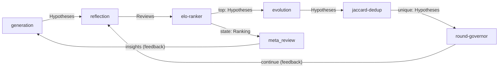

# AI Co-Scientist Graph

A reproduction of [Google Research's AI co-scientist](https://research.google/blog/accelerating-scientific-breakthroughs-with-an-ai-co-scientist/) (Feb 2025) as an Eureka graph. Given a research goal, it runs a multi-round hypothesis generation and refinement loop, producing a ranked set of novel scientific hypotheses and a meta-review overview.

## Topology



The graph runs until `round-governor` emits `halt` (after `max_rounds` rounds), at which point the scheduler terminates naturally.

## Nodes

### LLM Agents

| Node | Kind | Input | Output | Role |
|---|---|---|---|---|
| `generation` | `generation` | `Goal:in`, `Insights:context` | `Hypotheses:out` | Drafts novel hypotheses from the research goal, enriched by meta-review insights each round |
| `reflection` | `reflection` | `Hypotheses:in` | `Reviews:out` | Peer-reviews each hypothesis across multiple axes (novelty, feasibility, experimental testability) with a numeric score |
| `evolution` | `evolution` | `Hypotheses:in` | `Hypotheses:out` | Mutates and crossbreeds top-ranked hypotheses to produce a next generation |
| `meta_review` | `meta_review` | `Ranking:in` | `Insights:insights`, `Overview:overview` | Synthesizes the Elo leaderboard into actionable insights and a final research overview |

All four agents have access to the `arxiv_search` tool for literature search and paper retrieval.

### Control Plugins (Python subprocesses)

| Node | Kind | Input | Output | Role |
|---|---|---|---|---|
| `ranking` | `elo-ranker` | `Reviews:in` | `Hypotheses:top`, `Ranking:state` | Runs a pairwise Elo tournament; top-5 hypotheses by rating advance |
| `proximity` | `jaccard-dedup` | `Hypotheses:in` | `Hypotheses:unique` | Drops near-duplicate hypotheses (Jaccard ≥ 0.65) before the next round |
| `governor` | `round-governor` | `Hypotheses:in` | `Hypotheses:continue`, `Control:halt` | Passes hypotheses through for up to `max_rounds` rounds, then halts |

## File Structure

```
graphs/coscientist/
  graph.json                    <- GraphSpec (version 0.5.0)
  agents/
    generation.md               <- System preamble
    generation.json             <- Port declarations, output schema, tools, config
    reflection.md
    reflection.json
    evolution.md
    evolution.json
    meta_review.md
    meta_review.json
  plugins/
    elo-ranker/
      plugin.json               <- Plugin manifest (ports, command, roles)
      ranker.py                 <- Pairwise Elo with SQLite persistence
    jaccard-dedup/
      plugin.json
      dedup.py                  <- Word-level Jaccard similarity dedup
    round-governor/
      plugin.json
      governor.py               <- Round counter; halt after max_rounds
  tools/
    arxiv_search.py             <- arXiv search + full-text fetch tool
```

## Tool: `arxiv_search`

All three generative agents (`generation`, `reflection`, `evolution`) can call `arxiv_search` during their reasoning loop. The tool has two modes:

**`search`** — finds papers via the HuggingFace `librarian-bots/arxiv-metadata-snapshot` dataset server (no local download):

```json
{ "mode": "search", "query": "CO2 reduction catalysts", "max_results": 5, "page": 0 }
```

Returns title, abstract, authors, year, categories. Paginate with `page`.

**`fetch`** — retrieves full paper text via `arxiv2md` (falls back to abstract if not installed):

```json
{ "mode": "fetch", "arxiv_id": "2404.01234" }
```

### Installing `arxiv2md` (optional)

```bash
pip install arxiv2md
```

Without it, `fetch` mode returns the abstract from the metadata snapshot instead.

## Running

```bash
# From the repo root
export OPENROUTER_API_KEY=...

cargo run --bin eureka-cli -- run "Discover a novel catalyst for CO2 reduction"
```

The graph path defaults to `graphs/coscientist/graph.json` via `eureka.toml`.

## Configuration

Tune via `graph.json` node `config` blocks (no recompile needed):

| Node | Field | Default | Effect |
|---|---|---|---|
| `governor` | `max_rounds` | `5` | Number of full evolution cycles |
| `ranking` | `top_k` | `5` | Hypotheses advanced to `evolution` each round |
| `proximity` | `threshold` | `0.65` | Jaccard similarity above which a hypothesis is dropped |

Agent-level config in each `.json` file:

| Agent | `max_iterations` | `temperature` |
|---|---|---|
| `generation` | 12 | 0.9 |
| `reflection` | 10 | 0.7 |
| `evolution` | 10 | 0.9 |
| `meta_review` | 8 | 0.5 |

## Artifact Flow

```
Goal (injected at startup)
  └─ generation ──► Hypotheses
                        └─ reflection ──► Reviews
                                              └─ elo-ranker ──► Hypotheses (top-5)
                                                                    └─ evolution ──► Hypotheses
                                                                                         └─ jaccard-dedup ──► Hypotheses (unique)
                                                                                                                  └─ round-governor
                                                                                                                       ├─ continue ──► reflection (next round)
                                                                                                                       └─ halt (session ends)
                              elo-ranker ──► Ranking (state)
                                                └─ meta_review ──► Insights ──► generation (context)
                                                                   Overview (terminal output)
```

## Outputs

At the end of each round, the session database records:

- **`Ranking` artifact** — Elo ratings table + top-k hypothesis list
- **`Overview` artifact** — meta-review's final synthesis (terminal output; not consumed by any other node)
- **`Insights` artifact** — structured insights fed back into `generation`

Session data is persisted to `~/.eureka/sessions/<session-id>/session.db`.

## Reference

DeepMind / Google Research. *Towards an AI co-scientist.* Feb 2025.
