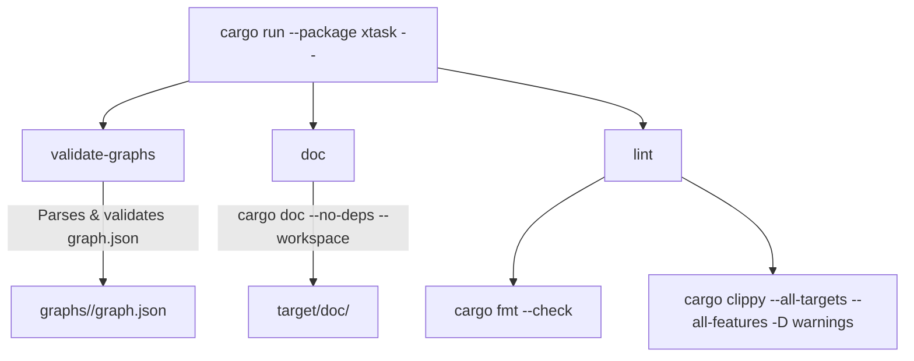

# xtask — Build Tasks for Eureka

**Status:** Active development · **Dependencies:** _None at compile time_ (parses graph specs at runtime) · **Key exports:** Binary `xtask`

Build automation: graph validation, documentation generation, and CI lint bundle. Follows the `cargo xtask` pattern for project-specific automation.

## Architecture

### Module Layout

```
src/
└── main.rs                  — CLI entry point (clap): 3 subcommands
```

### Commands



| Command | Args | Description | CI |
|---------|------|-------------|----|
| `validate-graphs` | `graph_dir` (default: `"graphs"`) | Validate all `graph.json` files found in subdirectories of `graph_dir` | ✅ Required |
| `doc` | `--open` | `cargo doc --no-deps --workspace` with optional browser open | ✅ Required |
| `lint` | — | Run `cargo fmt --check` then `cargo clippy --all-targets --all-features -- -D warnings` | ✅ Required |

### CI Integration

```yaml
# Recommended CI pipeline order:
jobs:
  - lint:   cargo run --package xtask -- lint
  - build:  cargo build --workspace
  - test:   cargo nextest run --workspace
  - graph:  cargo run --package xtask -- validate-graphs
  - doc:    cargo run --package xtask -- doc
  - deny:   cargo deny check
```

## Usage

```bash
# Always invoke via cargo run --package xtask
# (there is no .cargo/config.toml alias — `cargo xtask` is not valid)
cargo run --package xtask -- lint
cargo run --package xtask -- validate-graphs
cargo run --package xtask -- validate-graphs graphs/
cargo run --package xtask -- doc
cargo run --package xtask -- doc --open
```

## Testing

No unit tests — xtask is a thin CLI that delegates to `cargo` commands and the `eureka-graph` validator. Feature-gated integration tests are planned for CI scenarios.